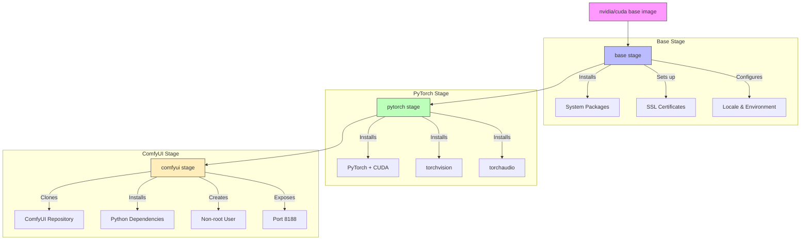

# aida-genai-workshop
Workshop files for the AIDA Data Hub Generative AI workshop

## VSCode Setup for Verdi/DSP System
1. Install Remote SSH extension in VSCode
2. Open VSCode Settings (File > Preferences > Settings / Code > Settings ... > Settings)
3. Search for and modify these settings:
```json
{
    "remote.SSH.showLoginTerminal": true,
    "remote.SSH.useLocalServer": false,
    "remote.SSH.enableAgentForwarding": true
}
```

## NFS Setup
1. Install NFS client:
```bash
sudo apt update
sudo apt install nfs-common
```

2. Create mount point and mount NFS share:
```bash
sudo mkdir -p /mnt/shared_folder
sudo mount 10.39.196.133:/shared_folder /mnt/shared_folder
```

## Docker Setup and Usage

1. Test CUDA compatibility:
```bash
docker run --rm --gpus all nvidia/cuda:12.4.1-cudnn-runtime-ubuntu22.04 nvidia-smi
```

2. Clone this repository:
```bash
git clone https://github.com/NBISweden/aida-genai-workshop.git
cd aida-genai-workshop
git branch docker-comfyui
```

3. Build the Docker image:
```bash
docker build -t comfyui .
```

4. Run the container with NFS mount:
```bash
docker run -it --gpus all \
  -p 8188:8188 \
  -v /mnt/shared_folder:/ComfyUI/models/checkpoints \
  comfyui
```

## Docker workflow

### Building the Image Locally

1. Modify the Dockerfile to use CPU-only mode by changing the CMD line:
```dockerfile
CMD ["python3", "main.py", "--listen", "0.0.0.0", "--port", "8188", "--cpu"]
```

2. Build the image for your platform:

**macOS(arm)**:
```bash
docker buildx build --platform=linux/amd64 -t comfyui:latest .
```

**Windows/Linux**:
```powershell
docker build -t comfyui:latest .
```

3. Login to Docker registry:
```bash
docker login
```

4. Tag and push the image:
```bash
docker tag comfyui-workshop <your-registry>/comfyui-workshop:latest
docker push <your-registry>/comfyui-workshop:latest
```

### Running the Container

**macOS**:
```bash
docker run --platform=linux/amd64 -p 8188:8188 comfyui
```

**Linux/Windows**:
```bash
docker run -p 8188:8188 comfyui
```

### Installing ComfyUI Manager

1. Execute into the running container:
```bash
docker exec -it <container_id> bash
```

2. Install ComfyUI Manager:
```bash
cd ComfyUI/custom_nodes
git clone https://github.com/ltdrdata/ComfyUI-Manager comfyui-manager
cd comfyui-manager
pip install -r requirements.txt
```

3. Exit the container and commit changes:
```bash
# Get container ID
docker ps

# Commit changes
docker commit <container_id> comfyui
```

### Saving and Transferring the Image

1. Save the image to a tar file:
```bash
docker save comfyui:latest > comfyui-custom.tar
```

2. Transfer to remote machine:
```bash
scp comfyui-custom.tar verdi-vm-cpu:/shared_folder/
```

3. On the remote machine, load the image:
```bash
sudo docker load < /mnt/shared_folder/comfyui-custom.tar
```

4. Run with docker-compose:
```bash
sudo docker compose up
```

## Understanding Multi-stage Builds

The development Dockerfile (Dockerfile.dev) uses multi-stage builds with the following stages:
- `base`: Sets up the basic Ubuntu environment with system dependencies
- `pytorch`: Installs PyTorch with CUDA support
- `comfyui`: Installs ComfyUI and its dependencies

### Multi-stage Build Flow



### Building Specific Stages

1. Build up to a specific stage:
```bash
# Build only up to the base stage
docker build -f Dockerfile.dev --target base -t comfyui:base .

# Build up to pytorch stage
docker build -f Dockerfile.dev --target pytorch -t comfyui:pytorch .
```

2. Resume building from a stage:
```bash
# If previous build failed at pytorch stage
docker build -f Dockerfile.dev --cache-from comfyui:base --target pytorch -t comfyui:pytorch .
```

### Handling Build Failures

If a build fails at a specific stage:
- Changes before the failing stage are cached
- You can debug the failing stage by creating a temporary container:
```bash
# If build fails at pytorch stage
docker run -it comfyui:base bash
# Now you can manually test the pytorch installation commands
```

### Best Practices for Multi-stage Builds

1. Tag intermediate stages for faster rebuilds:
```bash
# Tag the base image
docker build -f Dockerfile.dev --target base -t comfyui:base .
# Use the tagged base for subsequent builds
docker build -f Dockerfile.dev --cache-from comfyui:base -t comfyui:latest .
```

2. Use stage dependencies efficiently:
```bash
# Build multiple tags in one command
docker build -f Dockerfile.dev \
  --target base -t comfyui:base \
  --target pytorch -t comfyui:pytorch \
  --target comfyui -t comfyui:latest .
```

3. Pushing Specific Stages to Registry:
```bash
# Tag and push base stage
docker build -f Dockerfile.dev --target base -t registry.example.com/comfyui:base .
docker push registry.example.com/comfyui:base

# Tag and push pytorch stage
docker build -f Dockerfile.dev --target pytorch -t registry.example.com/comfyui:pytorch .
docker push registry.example.com/comfyui:pytorch

# Push multiple stages in one build
docker build -f Dockerfile.dev \
  --target base -t registry.example.com/comfyui:base \
  --target pytorch -t registry.example.com/comfyui:pytorch \
  --target comfyui -t registry.example.com/comfyui:latest .
docker push registry.example.com/comfyui:base
docker push registry.example.com/comfyui:pytorch
docker push registry.example.com/comfyui:latest

# Pull and use specific stage later
docker pull registry.example.com/comfyui:pytorch
docker build -f Dockerfile.dev --cache-from registry.example.com/comfyui:pytorch -t comfyui:latest .
```
